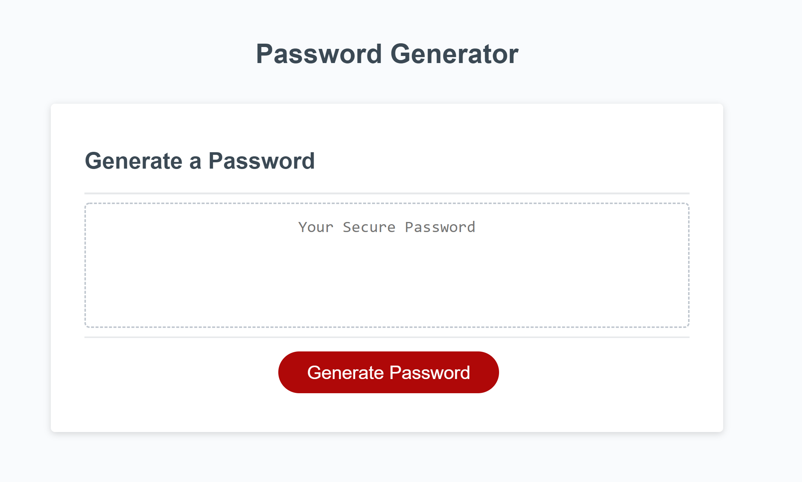

# passwordGenerator

# Overview
This program was created to randomly generate a password anywhere between 8 and 128 characters.
The user has the option to include the following types of characters: 

*Lower Case 

*Upper Case

*Numeric

*Special Characters

The user must select at least one character type, otherwise a password will not be generated. 

# Usage
All you need to use the password generator is internet access and a web browser!
Follow this link (https://mcm1015.github.io/passwordGenerator/)
Website Preview: 

If you want to view the working code follow this link [HTML CODE](index.html), [JavaScript](script.js) and this link [CSS CODE](./assets/css/style.css)

# Credits

(https://www.youtube.com/watch?v=duNmhKgtcsI)

(https://dev.to/olawanle_joel/password-generator-with-javascript-57c)

(https://google.com)

(https://www.youtube.com/watch?v=iKo9pDKKHnc)

(https://www.bitdegree.org/learn/javascript-prompt)

(https://www.w3schools.com/charsets/ref_utf_basic_latin.asp)

(https://www.w3schools.com/jsref/jsref_obj_regexp.asp)

# License

The [MIT](LICENSE) license was chosen for this project. 
